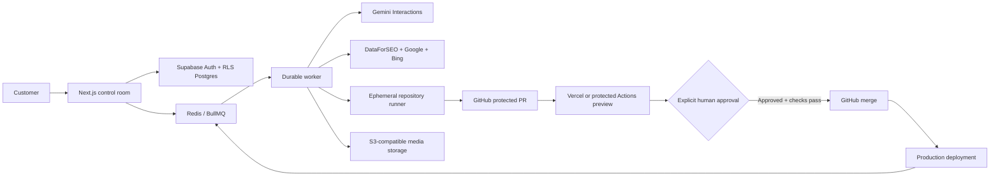

# Architecture

## Trust boundaries

1. Browser: untrusted input and explicit UI approval.
2. Control plane: authorization, tenant RLS, encrypted provider configuration, audit events, quota reservations.
3. Model plane: redacted evidence and repository excerpts only; no external-write credentials.
4. Runner: short-lived GitHub installation token, ephemeral filesystem, no cross-run state.
5. Production: reachable only through a protected GitHub merge and configured deployment workflow.

## Workflow state

`queued → running → completed|failed` for runs and `draft → checks_pending → ready → approved → merged` for proposals. `approved` is not equivalent to merged: GitHub checks and branch protection remain authoritative.

## Retention

Routine Gemini interactions use `store=false`. Redacted app audit metadata is retained for 30 days by the scheduled retention job. Raw repository snapshots are held only in ephemeral memory/filesystems. External provider retention still applies to background services that require stored interactions.
